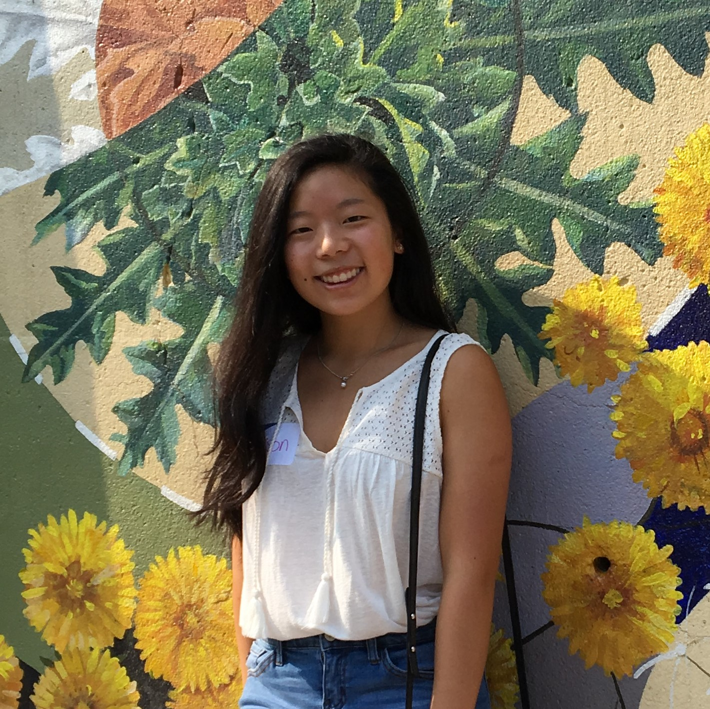

# BR3W
BR3W is a smart coffee machine that bridges customizability and convenience.

## Prerequisites
Run these commands to edit and observe **BR3W** software

### MacOS
``` 
$ brew install yarn
$ brew install node
$ brew install watchman
$ brew tap AdoptOpenJDK/openjdk
$ brew cask install adoptopenjdk8
```
#### What are we installing???
**Yarn**  
- Literally stands for Yet Another Resource Negotiator  
- Javascript Package Manager to automate the process of installing, updating, and configuring software

**Node.js**
- JavaScript Runtime Environment
- Basically allows you to run JavaScript with its libraries and APIs

**Watchman**
- File Watching Service
- Watches files and records changes within those files

**OpenJDK**
- Java Development Kit
- Free, open-source implementation for Java

#### React Native Command Line Interface
```$ npm install -g react-native-cli```


## Getting Started
### For IOS Testing:  
```$ react-native run-ios```  

### For Android Testing:  
Have an android emulator running  
```$ react-native run-android```


## Meet the Team
### Project Leads

**Bryan Pan, Software Lead**  
  
Insta: *@bryanthesnob*  
Github: *@BryanPan342*  

**Ashvin Nagarajan, Hardware Lead**  
  
Insta: *@anagarajan1*  
Github: *@ashvinnagarajan*

### Software Team
**Allison Chen, Software Developer**  
  
Github: *@allisonchen23*  

**Param Shah, Software Developer**  
  
Insta: *@\_param\_\_*  
Github: *@paramshah10*  

**Ashkan Faghihi, Software Developer**

**Connie Chen, Software Developer**

**Hubert Chen, Software Developer**

Insta: *@hubes.c*
Github: *@hubert94536*

### Hardware Team
**Janice Tsai, Software Developer**  
  

**Meilin Cui, Software Developer**

**Isha Gonugunta, Software Developer**

**Monica Bellare, Software Developer**


